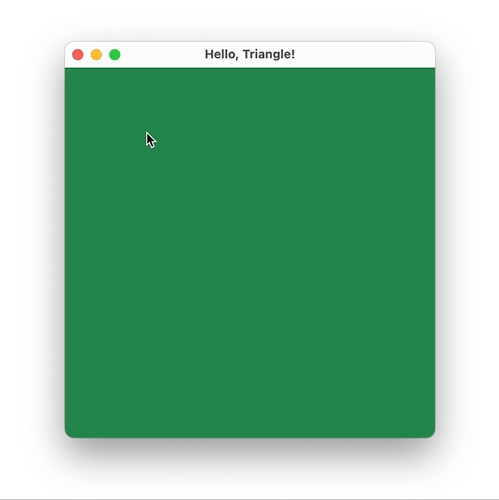

# Hello Triangle

This repository contains a test assignment made for the JetBrains Summer 2021 internship. The app uses `AppKit` to create a window and handle mouse events. The rendering is performed using [Metal](https://developer.apple.com/metal/).

## Build Instructions

1. Open `HelloTriangle.xcodeproj` in the latest Xcode
2. Make sure that `My Mac` is selected as a run destination
3. Run the project (⌘R)

> Tested on macOS Big Sur 11.2.3, Xcode 12.4

## Preview 

